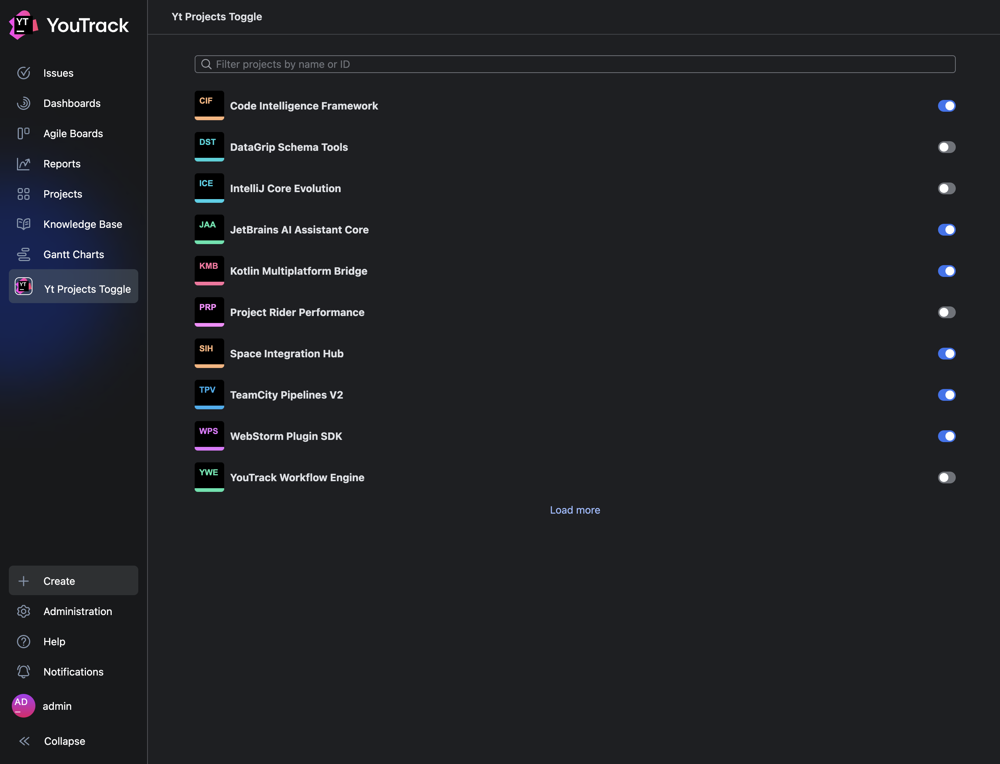

# YouTrack Project List & Toggle App



## Overview

This repository contains a simple demonstration application for [YouTrack](https://www.jetbrains.com/youtrack/). It
showcases how to integrate with YouTrack's apps system by adding a custom item to the main menu. This menu item opens a
page that lists available YouTrack projects and provides a toggle switch to control a boolean setting stored
persistently on the YouTrack server backend.

This project was created as a test practice assignment.

## Key Features

- Demonstrates YouTrack extension integration (`MAIN_MENU_ITEM` extension point).
- Displays a list of projects fetched via the YouTrack REST API.
- Includes a toggle switch for a persistent boolean flag (simulating a simple admin setting).
- Search and pagination for the project list.
- Built with React, TypeScript, and JetBrains Ring UI.

## Installation

### Option 1: From GitHub Releases (Recommended)

1. Download the `yt-projects-toggle.zip` file from
   the [GitHub Releases](https://github.com/TechOctopus/youtrack-app-assignment/releases) page.
2. In your YouTrack instance, navigate to `Administration` > `Apps`.
3. Click `Add app` than `Upload ZIP file` and select the downloaded `yt-projects-toggle.zip` file.

### Option 2: From Source Code

1. Clone the repository:

   ```bash
   git clone https://github.com/TechOctopus/youtrack-app-assignment/releases
   cd youtrack-app-assignment
   ```

2. Install dependencies:

   ```bash
   npm install
   ```

3. Build the application:

   ```bash
   npm run build
   ```

4. Upload the application to YouTrack using the command line:

   ```bash
   npm run upload -- --host <your-youtrack-base-url> --token <your-permanent-token>
   ```

   Alternatively, you can pack app wiht `npm pack` and then upload the `yt-projects-toggle.zip` file manually via the
   YouTrack UI as described in Option 1.

## Technology Stack

- **Frontend:** TypeScript, React, [Ring UI](https://github.com/JetBrains/ring-ui)
- **Schema Validation:** [Zod](https://zod.dev)
- **Integration:** YouTrack Scripting API
- **Build/CI:** npm scripts, GitHub Actions
